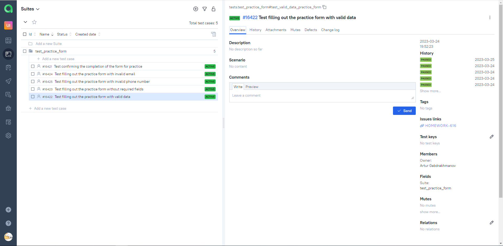
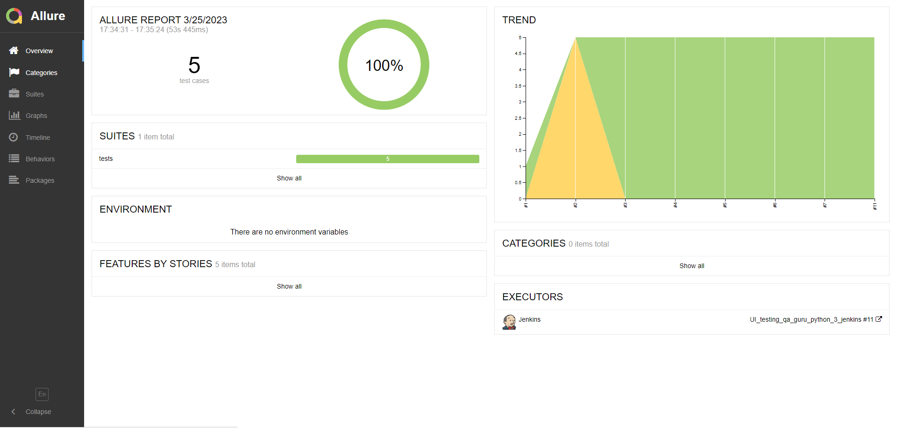
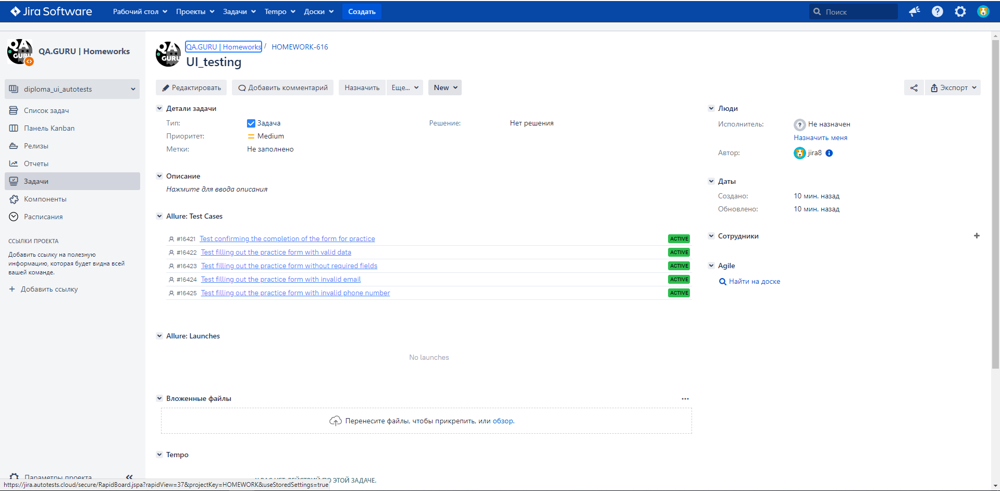
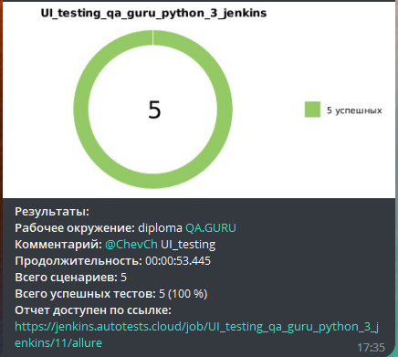

# Проект Ui_testing
##### Данный проект представляет собой ряд автотестов для проверки функциональности формы регистрации на сайте https://demoqa.com. 
Автотесты написаны на языке Python с использованием библиотеки pytest и фреймворка Selene для работы с Selenium WebDriver.

<!-- Технологии -->

### Используемые технологии

<code></code>
<code></code>
<code></code>
<code></code>
<code></code>
<code></code>
<code></code>
<code></code>
<code></code>

### Для запуска тестов необходимо установить следующие зависимости:

- Python 3
- Библиотеки pytest, selenium, selene, allure-pytest
- WebDriver для браузера Chrome
- Приложение Allure для формирования отчетов

### Для проверки корректности заполнения формы используются следующие тесты:
- Тест на заполнение формы с правильными данными
- Тест на заполнение формы с неправильным email
- Тест на заполнение формы без заполнения обязательных полей
- Тест на заполнение формы с неправильным номером телефона
- Тест на подтверждение завершения заполнения формы

##### Видео о прохождении одного из тестов

<!-- Jenkins -->

##  Jenkins
### [JOB](https://jenkins.autotests.cloud/job/UI_testing_qa_guru_python_3_jenkins/11/)
##### Кликните "Собрать сейчас"
запущенную сборку вы увидите в "Истории сборки" 

тамже рядом появятся две кнопки - зеленая откроет для нас allure test ops, а желтая allure report  

<!-- Allure TestOps -->

##  Allure TestOps
### [DASHBOARD](https://allure.autotests.cloud/launch/21112)
##### предоставляет общий обзор о процессе тестирования проекта, а также предоставляет различные метрики и отчеты для принятия решений на основе данных тестирования. Он позволяет визуализировать результаты тестирования и обнаруживать проблемы в продукте, что может помочь командам разработки улучшить качество своего продукта

##### описывает тест-кейсы, которые должны быть выполнены для тестирования конкретной функциональности продукта. Это позволяет лучше структурировать и организовать процесс тестирования, а также легко отслеживать прогресс и результаты тестирования

<!-- Allure report -->

##  Allure Report
### [ALLURE REPORT](https://allure.autotests.cloud/launch/21112)
##### это инструмент для генерации отчетов о результатах тестирования, которые позволяют наглядно отображать статус выполнения тестов, результаты прохождения их шагов, а также информацию о возможных проблемах и ошибках

<!-- Jira -->

##  Интеграция с Jira

<!-- Telegram -->

##  Telegram
##### в проект добавлена функция отправки Allure report с ключевой информацией в Telegram

