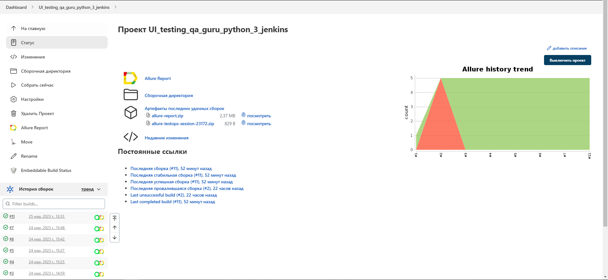
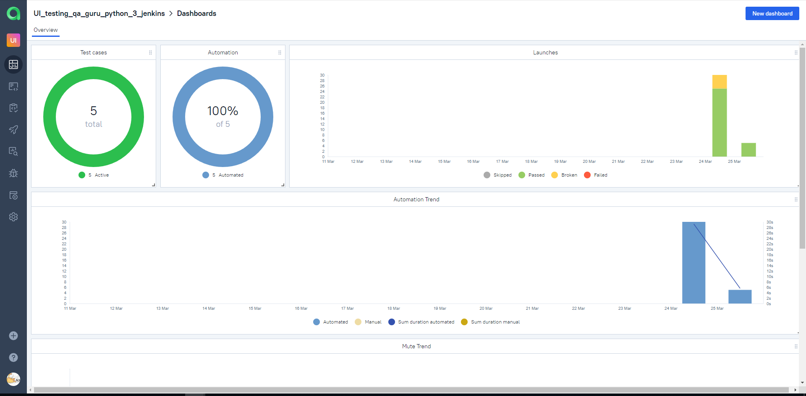

# Проект Ui_testing
##### Данный проект представляет собой ряд автотестов для проверки функциональности формы регистрации на сайте https://demoqa.com. 
Автотесты написаны на языке Python с использованием библиотеки pytest и фреймворка Selene для работы с Selenium WebDriver.

<!-- Технологии -->

### Используемые технологии

<code></code>
<code></code>
<code></code>
<code></code>
<code></code>
<code></code>
<code></code>
<code></code>
<code></code>

### Для запуска тестов необходимо установить следующие зависимости:

- Python 3
- Библиотеки pytest, selenium, selene, allure-pytest
- WebDriver для браузера Chrome
- Приложение Allure для формирования отчетов

### Для проверки корректности заполнения формы используются следующие тесты:
- Тест на заполнение формы с правильными данными
- Тест на заполнение формы с неправильным email
- Тест на заполнение формы без заполнения обязательных полей
- Тест на заполнение формы с неправильным номером телефона
- Тест на подтверждение завершения заполнения формы

<!-- Jenkins -->

##  Jenkins
### [JOB](https://jenkins.autotests.cloud/job/UI_testing_qa_guru_python_3_jenkins/11/)
##### Кликните "Собрать сейчас"
запущенную сборку вы увидите в "Истории сборки" 

тамже рядом появятся две кнопки - зеленая откроет для нас allure test ops, а желтая allure report  

<!-- Allure TestOps -->

##  Allure TestOps
### [DASHBOARD](https://allure.autotests.cloud/launch/21112)
##### предоставляет краткий обзор статуса и результатов тестирования проекта. На дашборде можно увидеть основные метрики, такие как количество пройденных и упавших тестов, процентное соотношение успешных и неуспешных тестов, время выполнения тестов, а также графики и диаграммы, отражающие динамику выполнения тестов и результаты тестирования по версиям проекта. Все данные отображаются в удобной и понятной форме, что позволяет быстро оценить общую картину тестирования и принимать необходимые меры для улучшения качества продукта

